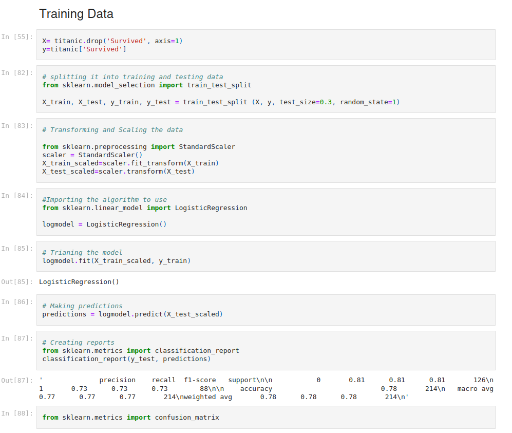

# Titanic dataset Analysis

The analysis of the Titanic dataset primarily revolves around investigating the factors
influencing survival rates among passengers aboard the Titanic.
By scrutinizing passenger attributes like age, gender, class, and family relationships,
the analysis seeks to unveil patterns
and correlations that played a role in determining who survived the tragic maritime disaster.

Through exploratory data analysis and statistical techniques,
the study aims to gain insights into the socio-demographic dynamics that contributed
to differential survival outcomes,
shedding light on the human aspects of the historic event.
